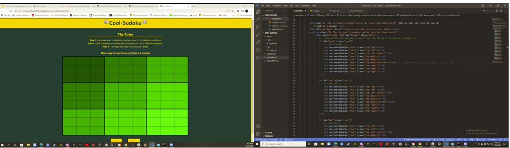

# Cool-Sudoku 

Simple Interactive Sudoku Application

## Description 
As a consumer of games and a lover of logic,

We wanted to create a game that would be fun yet challenging. Something that would spark intrest and create a love for the game of Sudoku. 

We wanted our game to apeal to the first time user, the novice and those that may have a little more experience. 

Our game is simple yet challenging and we belive it is just the right stepping stone to begin a love of Sudoku.

## API Reference 
"https://sugoku.herokuapp.com/board?"

    

## Contributors
Kevin Foreman  https://github.com/kevin-foreman
Samantha Wolff https://github.com/samanthawolff 
Monica Solano  https://github.com/Bluebear1701

## Screenshots

## 🔗 Links
https://www.w3schools.com/

https://cdn.jsdelivr.net/npm/bulma@0.9.3/css/bulma.min.css
